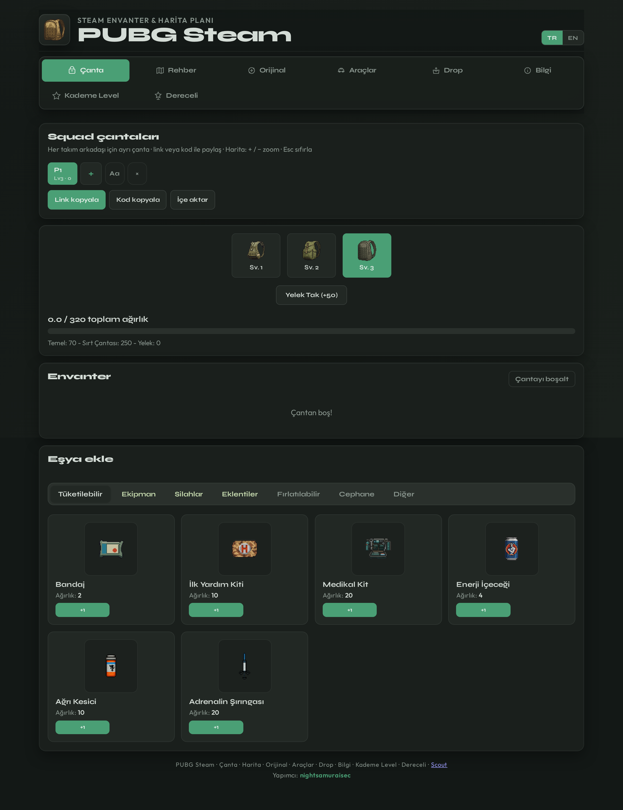
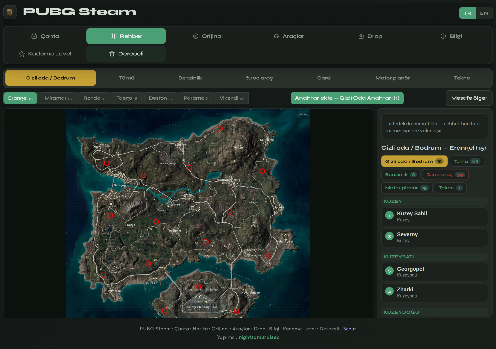
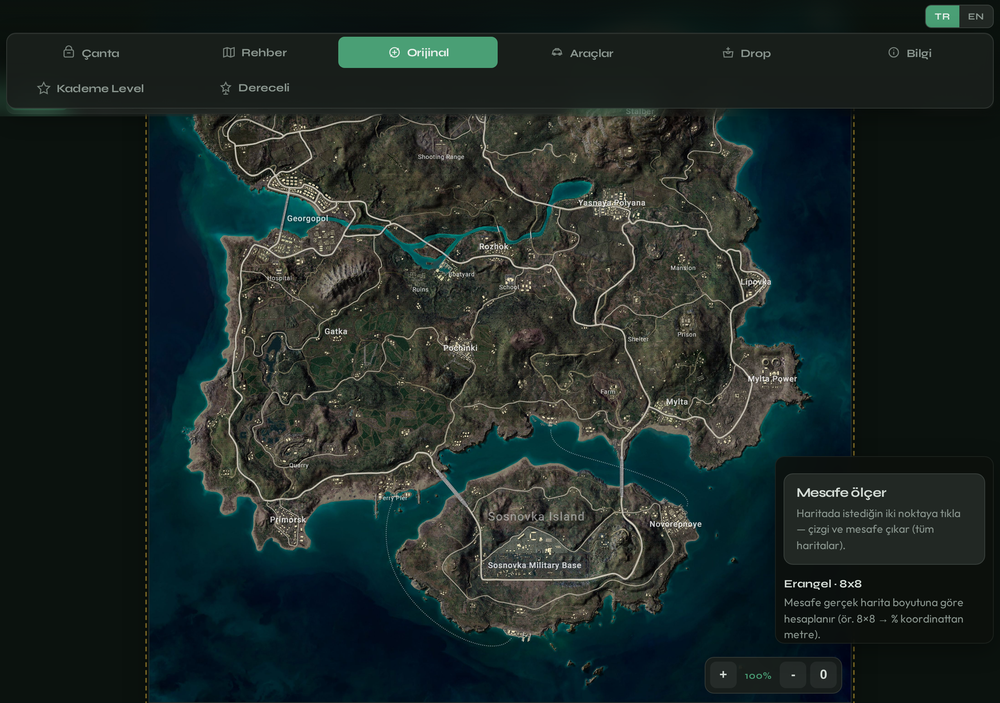
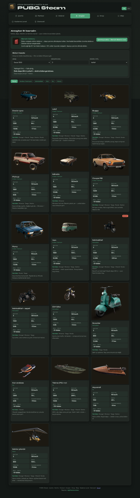
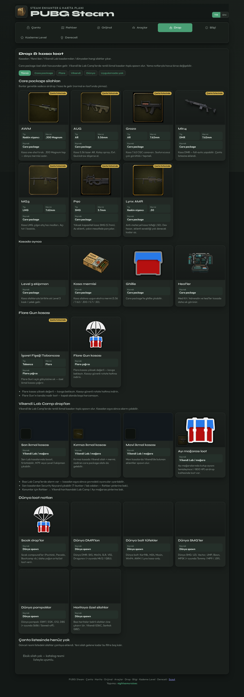
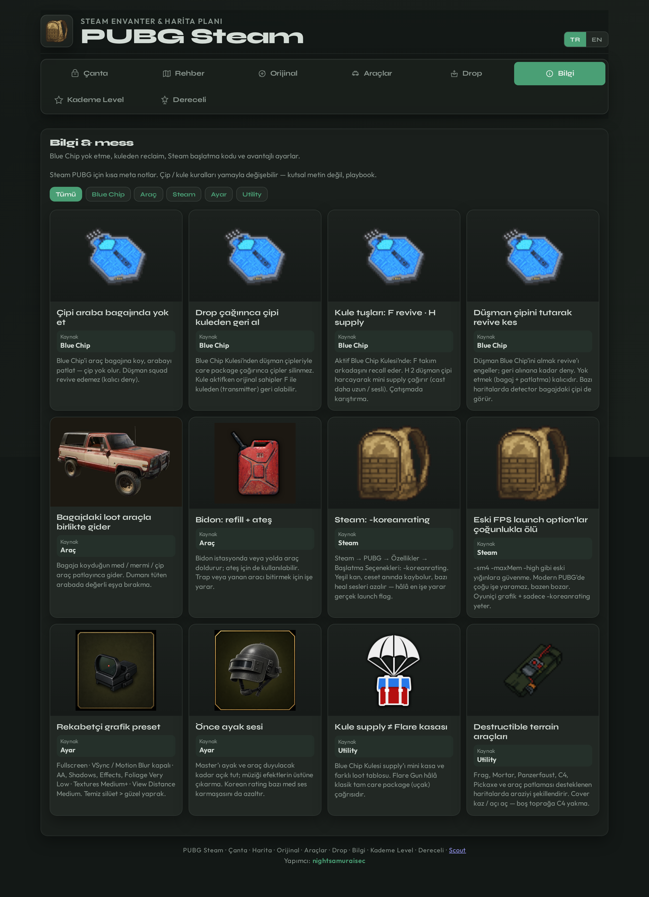
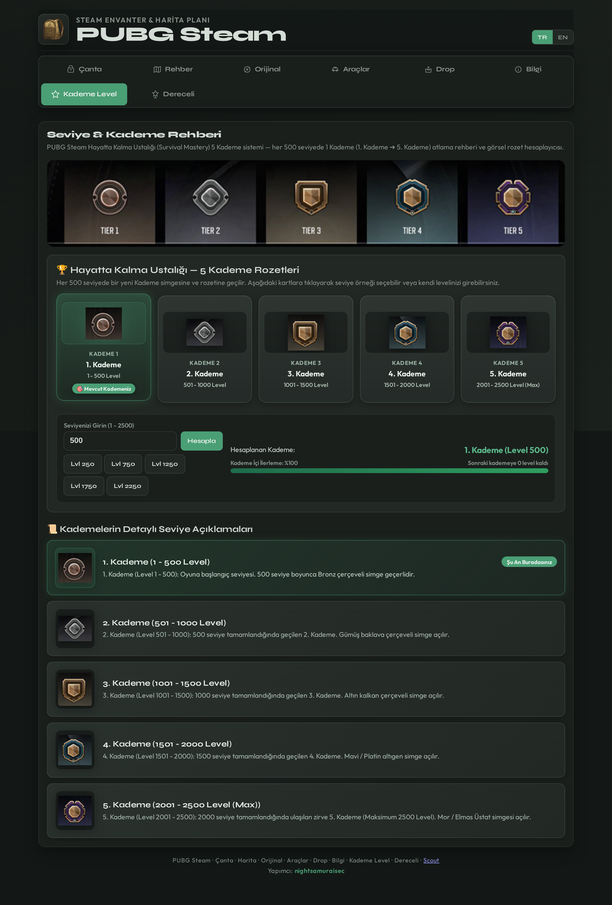
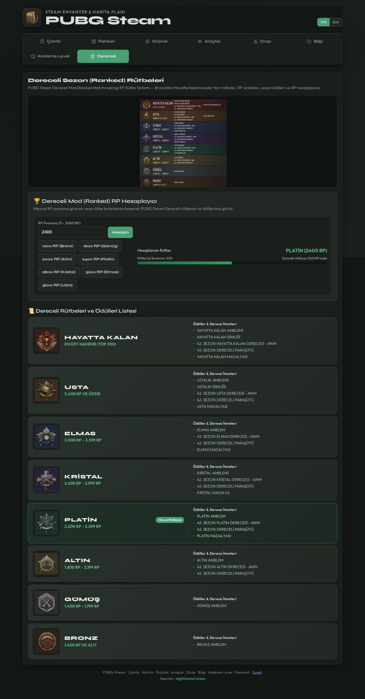

# PUBG Steam Guide

> 🇹🇷 [Türkçe sürüm için tıklayın](README-tr.md)

<p align="center">
  
  
  
</p>

<p align="center">
  
  
  
</p>

<p align="center">
  <strong>Bag planner · secret basement maps · TR/EN</strong>
</p>

<p align="center">
  <a href="https://nightsamuraisec.github.io/pubg-steam-guide/"></a>
</p>

<p align="center">
  <a href="#-about-the-project">About</a> ·
  <a href="#-screenshots">Screenshots</a> ·
  <a href="#-features">Features</a> ·
  <a href="#-folder-structure">Structure</a> ·
  <a href="#-built-with">Built With</a> ·
  <a href="#-getting-started">Getting Started</a> ·
  <a href="#-usage">Usage</a>
</p>

---

## 📌 About The Project

**PUBG Steam Guide** is a free browser companion — no install, no account, no download.

### Use it now

👉 **[https://nightsamuraisec.github.io/pubg-steam-guide/](https://nightsamuraisec.github.io/pubg-steam-guide/)** — open the link and play.

| Section | What it does |
| --- | --- |
| **Bag** | Plan squad loadouts, track weight limits, share via link (`?bag=`) |
| **Map** | Secret basement & service room guides (Erangel, Miramar, Taego…) |
| **Original** | Full-screen original map images |
| **Vehicles** | Vehicle stats + fuel / jerrycan calculator |
| **Drops** | Care package & loot guide |
| **Tips** | Steam / in-game tips |
| **Mastery (Kademe)** | Survival Mastery 5-level calculator |
| **Ranked** | Ranked RP tiers, rewards & calculator |

- 🌐 **TR / EN** — switch language from the top bar
- 📱 Mobile & desktop friendly, dark theme
- 🔗 Share your bag plan via URL

> Fan-made tool — not affiliated with PUBG, Steam, or Krafton. Data stays in your browser.

---

## 🖼 Screenshots

> Dark-mode UI captures — preview is compact; **click any image for full size**.

### Bag

<p align="center">
  <a href="screenshots/bag.png" title="Enlarge">
    
  </a>
</p>
<p align="center"><sub>🔍 Click to enlarge</sub></p>

### Map (Guide)

<p align="center">
  <a href="screenshots/maps.png" title="Enlarge">
    
  </a>
</p>
<p align="center"><sub>🔍 Click to enlarge</sub></p>

### Original map

<p align="center">
  <a href="screenshots/original.png" title="Enlarge">
    
  </a>
</p>
<p align="center"><sub>🔍 Click to enlarge</sub></p>

### Vehicles

<p align="center">
  <a href="screenshots/vehicles.png" title="Enlarge">
    
  </a>
</p>
<p align="center"><sub>🔍 Click to enlarge</sub></p>

### Drops

<p align="center">
  <a href="screenshots/drops.png" title="Enlarge">
    
  </a>
</p>
<p align="center"><sub>🔍 Click to enlarge</sub></p>

### Tips

<p align="center">
  <a href="screenshots/tips.png" title="Enlarge">
    
  </a>
</p>
<p align="center"><sub>🔍 Click to enlarge</sub></p>

### Mastery level (Kademe)

<p align="center">
  <a href="screenshots/rank.png" title="Enlarge">
    
  </a>
</p>
<p align="center"><sub>🔍 Click to enlarge</sub></p>

### Ranked

<p align="center">
  <a href="screenshots/ranked.png" title="Enlarge">
    
  </a>
</p>
<p align="center"><sub>🔍 Click to enlarge</sub></p>

---

## ✨ Features

- 🎒 Bag / weight planner
- 🗺 Secret basement map guide
- 🗾 Original full-screen map
- 🚗 Vehicle & fuel guide
- 📦 Drop / care package guide
- 💡 Steam tips
- 🏆 Survival mastery levels (Kademe)
- 🎖 Ranked RP & rewards
- 🔗 `?bag=` share links
- 🌐 TR / EN

- 📸 **README screenshots** — Stored in `screenshots/` for the repo README. Regenerate with `tools/capture-screenshots.mjs` or the GitHub Actions workflow.

---

## 🗂 Folder Structure

```text
pubg-steam-guide/
├── index.html
├── css/
├── js/
├── images/
├── screenshots/
│   ├── bag.png
│   ├── maps.png
│   ├── original.png
│   ├── vehicles.png
│   ├── drops.png
│   ├── tips.png
│   ├── rank.png
│   └── ranked.png
├── tools/
│   └── capture-screenshots.mjs
├── .nojekyll
├── README.md
└── README-tr.md
```

> `screenshots/` — README preview images (maintainer / CI output).

---

## 🛠 Built With

- HTML5 / CSS3 / JS
- GitHub Pages

---

## 🚀 Getting Started

### Live site (recommended)

Open in your browser: **[nightsamuraisec.github.io/pubg-steam-guide](https://nightsamuraisec.github.io/pubg-steam-guide/)**

### Run locally (optional)

```bash
git clone https://github.com/nightsamuraisec/pubg-steam-guide.git
cd pubg-steam-guide
npx --yes serve .
```

---

## 📖 Usage

Plan a bag → copy share link. Use Guide tab for maps/filters.

### Refresh README screenshots (maintainers)

```bash
node tools/capture-screenshots.mjs
```

Or push to `main` — `.github/workflows/screenshots.yml` updates `screenshots/` when UI changes.

---

## 📄 License

Distributed under the **MIT License**. See [`LICENSE`](LICENSE).

Issues and contributions are welcome via GitHub.

---

<p align="center"><sub>PUBG Steam Guide · open-source / portfolio</sub></p>
